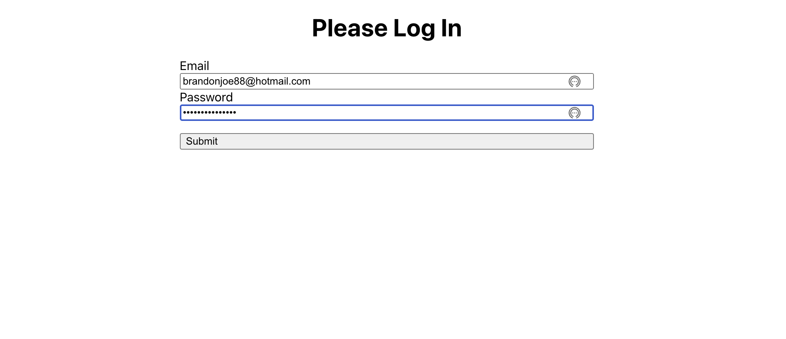
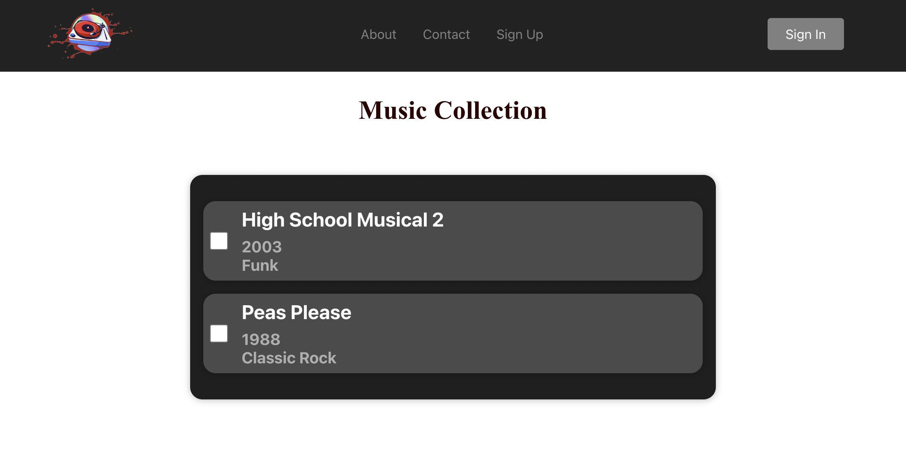

# README
## Music Collection FE

Built using React.js, with a Rails BE, this intuitive and informative database is helpful to keep track of owned and wishlisted music albums.




<a name="readme-top"></a>

<details>
  <summary>Table of Contents</summary>
  <ul list-style-position="inside">
    <li>
      <a href="#about-the-project">About The Project</a>
      <ul>
        <li><a href="#learning-goals">Learning Goals</a></li>
        <li><a href="#built-with">Built With</a></li>
        <li><a href="#roadmap">Roadmap</a></li>
      </ul>
    </li>
    <li>
      <a href="#getting-started">Getting Started</a>
      <ul>
        <li><a href="#prerequisites">Prerequisites</a></li>
        <li><a href="#installation">Installation</a></li>
      </ul>
    </li>
    <li>
      <a href="#usage">Usage</a>
      <ul>
        <li><a href="#endpoints">Endpoints</a></li>
      </ul>
    </li>
    <li>
      <a href="#contributing">Contributing</a>
      <ul>
        <li><a href="#developers">Developers</a></li>
        <li><a href="#project-managers-instructors">Project Managers-Instructors</a></li>
      </ul>
    </li>
  </ol>
</details>

## About the Project
  
  ### Production Links
  
  * [Music Collection BE](https://github.com/bgray88/music_collection_be) <br>
  * [Music Collection FE](https://github.com/bgray88/music_collection_fe) <br>

  ### Learning Goals

  * React.js implementation of hobby necessity

  ### Built With

  [![React]][React-url] [![Rails]][Rails-url][![Postgres]][Postgres-url][![Postman]][Postman-url]

  ### Roadmap
  <details>
    <summary>Done</summary>
    - [x] Design Schema<br>
    - [x] Add Readme<br>
    - [x] Setup Repo and Push to Github<br>
    - [x] Readme: Outlines the learning goals<br>
    - [x] Readme: Clone and Setup<br>
  </details>
  <details>
    <summary>In Progress</summary>
  </details>

  <p align="right">(<a href="#readme-top">back to top</a>)</p>

## Getting Started

  ### Prerequisites

  * React "^18.2.0"

  ### Installation

  _Below are instructions for forking and cloning this repo_

1. Clone the repo
  ```sh
  git clone git@github.com:bGray88/music_collection_fe.git
  ```
  2. Install Modules
  ```sh
  npm install
  ```
  3. Download the Backend and setup per instructions
  ```js
  git clone git@github.com:bGray88/music_collection_be.git
  ```
  4. Run the servers
  ```js
  api: cd [INSTALL_DIRECTORY]/music_collection_be && rails server
  web: yarn --cwd music_collection_fe start
  ```

  <p align="right">(<a href="#readme-top">back to top</a>)</p>

## Usage
  
  ### Pages - Welcome

  ### Pages - Login
  
  
  
  ### Pages - Dashboard

  

  ### Pages - New Album

## Contributing

  Contributions are what make the open source community such an amazing place to learn, inspire, and create. Any contributions you make are **greatly appreciated**.

  If you have a suggestion that would make this better, please fork the repo and create a pull request. You can also simply open an issue with the tag "enhancement".
  Don't forget to give the project a star! Thanks again!

  1. Fork the Project
  2. Create your Feature Branch (`git checkout -b feature/AmazingFeature`)
  3. Commit your Changes (`git commit -m 'Add some AmazingFeature'`)
  4. Push to the Branch (`git push origin feature/AmazingFeature`)
  5. Open a Pull Request

  ### Developers

  <div align="center">
    
    <p align="center">
      Brandon Gray<br>
      <a href="https://github.com/bGray88">Github: bGray88</a><br>
      <a href="https://www.linkedin.com/in/brandon-gray-67903689/">LinkedIn: Brandon Gray</a>
    </p>
  </div>

  <p align="right">(<a href="#readme-top">back to top</a>)</p>

  [React]: https://img.shields.io/badge/React-20232A?style=flat&logo=react&logoColor=61DAFB
  [React-url]: https://react.dev/
  [Ruby]: https://img.shields.io/badge/-Ruby-CC342D?style=flat&logo=ruby&logoColor=white
  [Ruby-url]: https://www.ruby-lang.org/en/
  [Rails]: https://img.shields.io/badge/-Ruby%20on%20Rails-CC0000?style=flat&logo=rubyonrails&logoColor=white
  [Rails-url]: https://rubyonrails.org
  [Postgres]: https://img.shields.io/badge/-Postgres-4169E1?style=flat&logo=postgresql&logoColor=white
  [Postgres-url]: https://www.postgresql.org/
  [Postman]: https://img.shields.io/badge/-Postman-FF6C37?style=flat&logo=postman&logoColor=white
  [Postman-url]: https://www.postman.com/